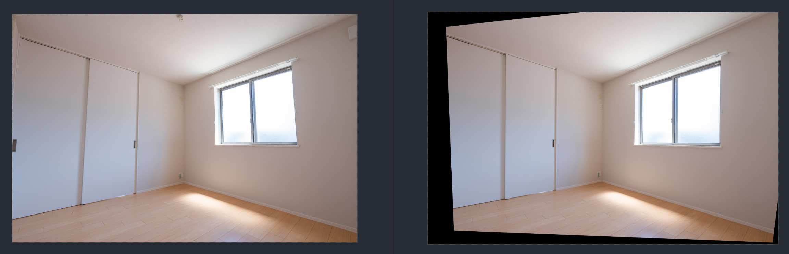
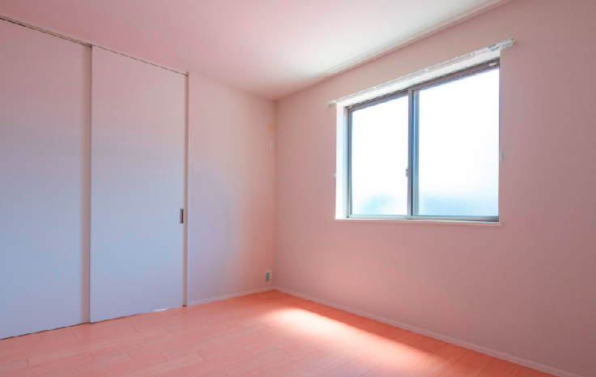

# Perspective Transformation using Line Detector and Optimization

[Thien Do-Tieu](https://github.com/dotieuthien)

### Overview
This is the Python implementation of [paper](https://www.semanticscholar.org/paper/Rectification-of-planar-targets-using-line-segments-An-Koo/e1feceb12777c06727da3b281d2b8d7472182444) 
for perspective transformation. By using line detector, this approach creates a loss function which contains information
of tilt angle of vertical and horizontal lines, and an optimization algorithm tries to minimize loss value, simultaneously 
update rotate angles in perspective matrix. In this implementation, I used Gradient Descent instead of Levenberg–Marquardt algorithm

### Installation
Install line detector package for python 3
```
pip install pylsd
pip install ocrd-fork-pylsd
```

### Result
#### Image after rendering



#### The result after cropping



